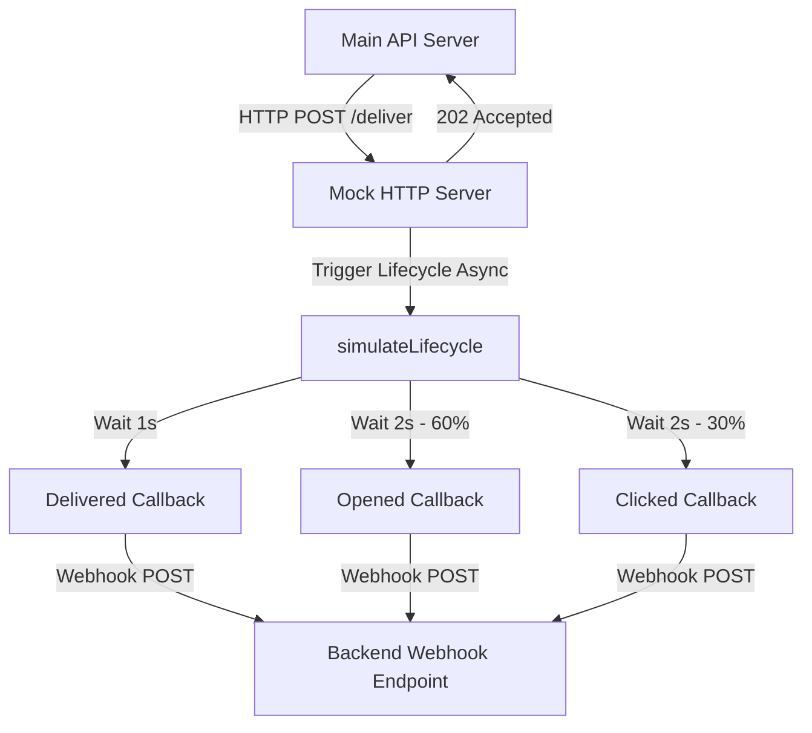

# 📡 StyleHub Xeno CRM — Carrier Channel Service

The **Carrier Channel Service** is a lightweight, event-driven microservice that simulates real-world communication providers (SendGrid, Twilio, WhatsApp Business, and Push notifications). It processes campaign dispatches asynchronously and simulates delivery receipts back to the main backend API.

---

## 🏗️ Architecture & Core Decisions



### Key Technical Decisions:
1. **Plain Node.js Server**: Implemented as a lightweight microservice using standard Node.js `http` module without heavy framework overhead.
2. **Immediate Acknowledgment (202 Accepted)**: Responds to incoming delivery requests immediately with a unique `providerMessageId` to keep client request-response loops short.
3. **Asynchronous Webhook Callback Loops**: Runs callbacks via non-blocking timers (`setTimeout`) to simulate real-world transmission delays, network roundtrips, and carrier receipt times.
4. **Behavioral Realism Simulation**: 
   * **Failure Baselines**: Automatically triggers a carrier delivery error (`FAILED` status) if a recipient's phone/email contains the string `"fail"` or due to a baseline 5% carrier failure rate.
   * **Funnel Probability Scaling**: Models human interaction with messages (e.g. 60% probability of opening, followed by 30% probability of clicking links).

---

## 📂 File Structure Hierarchy

The channel service directory contains:

```
deploy-ready/channel-service/
├── src/
│   └── main.ts                 # Service entry point (HTTP Server, Delivery lifecycle simulator)
├── package.json                # Microservice dependencies & start scripts
└── tsconfig.json               # TypeScript compiler config
```

---

## 🚀 Feature Functionality

### 1. Delivery Payload Ingestion (`/deliver`)
Exposes a single POST endpoint accepting payloads from the main backend queue workers:
* **Fields**:
  * `logId`: Unique tracking id for the message.
  * `recipient`: Destination email or phone number.
  * `channel`: Delivery medium (`EMAIL`, `SMS`, `WHATSAPP`, `PUSH`).
  * `message`: Content text.
  * `callbackUrl`: Main API callback receiver endpoint.

### 2. Multi-Stage Event Webhooks
Dispatches events sequentially back to the backend's `/webhooks/delivery` endpoint using the `fetch` API:
* **`DELIVERED`**: Dispatched 1 second after ingestion (simulates server-to-recipient transit).
* **`OPENED`**: Dispatched 2 seconds after delivery (60% probability).
* **`CLICKED`**: Dispatched 2 seconds after message read (30% probability).
* **`FAILED`**: Dispatched immediately if recipient has `"fail"` in their credentials, or with a 5% baseline rate (triggers error codes like `UNDELIVERABLE`).

---

## 🛠️ Deployment Instructions (Render)

### 1. Environment Configuration
Create a `.env` file or configure variables in your hosting provider:
* `CHANNEL_PORT`: Port to list on (defaults to `3001`).
* `REDIS_URL`: Redis queue host.

### 2. Render Web Service Settings
* **Runtime**: `Node`
* **Build Command**: `npm install && npm run build`
* **Start Command**: `npm run start`
* **Environment Variables**:
  * `PORT`: `3001`
  * `BACKEND_URL`: `https://[your-backend-app].onrender.com/api/v1`
